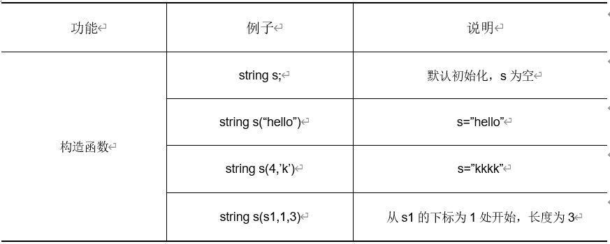
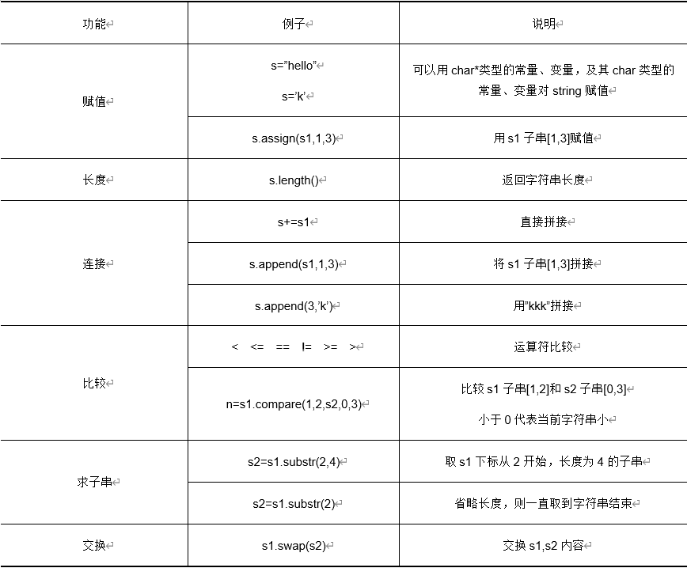
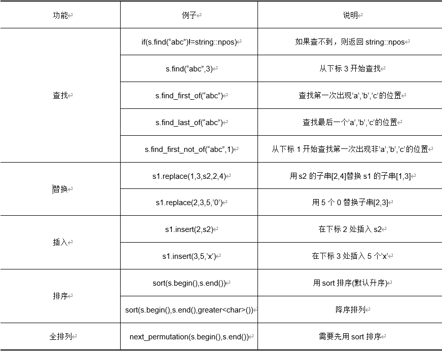

## 1. 定义



## 2. 常用操作





### 末尾添加
```c++
s.push_back('a');	//末尾添加字符'a'，必须是字符形式
s.append("abc");	//末尾添加字符串"abc",必须是字符串形式
```
### 反转

```c++
reverse(s.begin(),s.end());
```

### 迭代器方法查找

```c++
string s("afgcbed");
string::iterator p = find(s.begin(),s.end(),'c');
if(p != s.end()){
	cout << p-s.begin() << endl; //输出3
}
```

### 尾部查找

```c++
s.rfind('a'); 		//从尾部开始查找a;
s.rfind('a',1);		//从位置1处，向前查找'a'
```

## 3. 类型转换

#### 3.1 数-->string

##### （1）to_string函数

```c++
string s=to_string(3.1415);
```

##### (2) 字符串流

```c++
int a=30;
stringstream ss;
ss<<a;
string s1=ss.str();
```

#### 3.2 string-->数

##### （1）atoi函数

> 浮点型(atof())，long型(atol())

```c++
string str="123";
int n=atoi(str.c_str());
```

##### （2）字符串流

```c++
istringstream is(s);
int i;
is>>i;
```

## 4. 空格跳过

```c++
string s, buf;
while (cin >> s) {
    stringstream ss(s);
    while (ss >> buf) {
        cout << buf << endl;
    }
}
```

## 5. 大小写转换

```c++
string s="abc";
transform(s.begin(),s.end(),s.begin(),::toupper); //大写
transform(s.begin(),s.end(),s.begin(),::tolower); //小写
s[1]=tolower(s[1]);
s[2]=toupper(s[2]);
```

## 6. 与C串转换

### 6.1 C串转string

```c++
char str[]="hello world";
string str2(str);
```

### 6.2  string转C串

#### (1) c_str(string转char*)

```c++
const char* str1=str2.c_str();
```

#### (2) strcpy(string转char数组)

```c++
string str("hello");
char array[str.length()];
strcpy(array,str.data());
```

#### (3)data(string转char*)

```c++
string str="hello";
const char* p = str.data();
```


## stringstream

### 读取一行中若干个整数

```c++
int main()
{
	string line;
	while(getline(cin, line)){
		int sum=0, x;
		stringstream ss(line);
		while(ss >> x) sum+=x;
		cout << sum << endl;
	}
}
```

