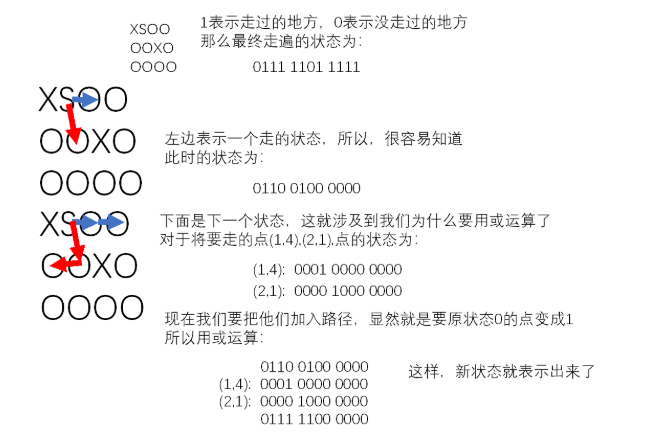

## 0804

[网络流](https://www.cnblogs.com/fzl194/p/8855101.html)

- [ ] [牛客多校赛1-H](https://ac.nowcoder.com/acm/contest/5666/H)：网络流

  [参考代码](https://ac.nowcoder.com/acm/contest/view-submission?submissionId=44516260)

- [ ] [牛客多校赛8-E](https://ac.nowcoder.com/acm/contest/5673/E)

  [差分](https://blog.csdn.net/tianyizhicheng/article/details/107773762)

## 0803

- [ ] [Count New String](https://ac.nowcoder.com/acm/contest/5669/C)：

  多个串求本质不同字串：广义后缀自动机


## 0729

### [CF-EDU92](https://codeforces.com/contest/1389)

- [题解](https://codeforces.com/blog/entry/80809)

- [x] B：DP
- [x] C：字符串模拟


### [搜索+数位DP训练](https://vjudge.net/contest/386177)

- [x] [CSL的校园卡](https://ac.nowcoder.com/acm/problem/17872?&headNav=acm)：BFS+状压

  建立数组`vis[id][x1][y1][x2][y2]`，id为走过的路径，压缩为一个值，x1表示A的当前x坐标，y1表示A的当前y坐标，x2表示B的当前x坐标，y2表示B的当前y坐标。对两个点进行bfs即可，注意计算路径id值时应该用或|进行计算。当id等于结束值时返回结果

  

  ```c++
  #define ONLINE_JUDGE
  #include <bits/stdc++.h>
  using namespace std;
  #define endl '\n'
  typedef long long ll;
  const int maxn = 1 << 16 + 1;
  int n, m;
  int G[5][5];
  int stax, stay, tar, ans;
  bool vis[maxn][5][5][5][5];
  char c;
  struct node
  {
      int x1, y1, x2, y2;
      int now, dep;
      node(int X1, int Y1, int X2, int Y2, int NOW, int DEP)
          : x1(X1), y1(Y1), x2(X2), y2(Y2), now(NOW), dep(DEP) {}
  };
  inline bool check(int x, int y)
  {
      if (x >= 0 && x < n && y >= 0 && y < m && G[x][y] == 1)
          return true;
      else
          return false;
  }
  int dx[] = {1, -1, 0, 0}, dy[] = {0, 0, 1, -1};
  void BFS()
  {
      queue<node> q;
      q.push(node(stax, stay, stax, stay, 1 << (stax * m + stay), 0));
      vis[1 << (stax * m + stay)][stax][stay][stax][stay] = 1;
      while (!q.empty()) {
          int x1, y1, x2, y2, now, dep;
          x1 = q.front().x1;
          y1 = q.front().y1;
          x2 = q.front().x2;
          y2 = q.front().y2;
          now = q.front().now;
          dep = q.front().dep;
          q.pop();
          if (now == tar) {
              ans = dep;
              break;
          }
          for (int i = 0; i < 4; i++) {
              int nx1 = x1 + dx[i], ny1 = y1 + dy[i];
              if (!check(nx1, ny1)) continue;
              for (int j = 0; j < 4; j++) {
                  int nx2 = x2 + dx[j], ny2 = y2 + dy[j];
                  if (!check(nx2, ny2)) continue;
                  int tmp = now | (1 << (nx1 * m + ny1)) | (1 << (nx2 * m + ny2));
                  if (!vis[tmp][nx1][ny1][nx2][ny2]) {
                      vis[tmp][nx1][ny1][nx2][ny2] = 1;
                      q.push(node(nx1, ny1, nx2, ny2, tmp, dep + 1));
                  }
              }
          }
      }
  }
  int main()
  {
  #ifndef ONLINE_JUDGE
      freopen("in.txt", "r", stdin);
      // freopen("out.txt", "w", stdout);
  #endif
      ios::sync_with_stdio(0), cin.tie(0);
      cin >> n >> m;
      for (int i = 0; i < n; i++) {
          for (int j = 0; j < m; j++) {
              cin >> c;
              if (c == 'X') {
                  G[i][j] = 0;
              }
              else {
                  G[i][j] = 1;
                  tar |= (1 << (i * m + j));  // 用二进制保存最终走遍的状态
              }
              if (c == 'S') {
                  stax = i, stay = j;
              }
          }
      }
      BFS();
      cout << ans << endl;
  }
  ```

- [ ] 


## 0727
### [牛客多校赛6](https://ac.nowcoder.com/acm/contest/5671)
- [ ] G：构造
- [ ] K：DP？


## 0205
### [牛客寒假集训营一](https://ac.nowcoder.com/acm/contest/3002#question)
[题解](https://ac.nowcoder.com/discuss/364600?tdsourcetag=s_pctim_aiomsg)
- [ ] C：计算几何
- [ ] F：树
- [ ] J：数论

### [CF #617](https://codeforces.com/contest/1296)
[题解](https://codeforces.com/blog/entry/73627)
- [ ] E

### 0206
### [牛客寒假集训营二](https://ac.nowcoder.com/acm/contest/3003#question)
[题解](https://ac.nowcoder.com/discuss/364961?tdsourcetag=s_pctim_aiomsg)
- [ ] H：【DP】
用$f_i$表示用掉前$i$个元素的最小代价
    $$ f_i=\min_{j\in [1,i-k+1]} \lbrace f_{j-1}+a_i-a_j \rbrace = \min_{j\in [1,i-k+1]} \lbrace f_{j-1}-a_j \rbrace + a_i$$
该转移方程考虑把当前元素和之前的至少k个元素进行组合，可以将$a_i$提取出来，对于每一个$i$，更新$\min_{j\in [1,i-k+1]} \lbrace f_{j-1}-a_j \rbrace$，也就是$f_{i-k+1}-a_{i-k+2}$
```c++
const int maxn = 3e5 + 10;
int n, k, a[maxn], dp[maxn]; //用掉前i个元素的最小代价
int pre;
int main()
{
    cin >> n >> k;
    for (int i = 1; i <= n; i++) {
        cin >> a[i];
    }
    sort(a + 1, a + 1 + n);
    pre = 0 - a[1];
    for (int i = 1; i < k; i++) { //至少k个元素才有意义
        dp[i] = 2e9;
    }
    for (int i = k; i <= n; i++) {
        dp[i] = pre + a[i];
        pre = min(pre, dp[i - k + 1] - a[i - k + 2]); //维护前缀最小值
    }
    cout << dp[n] << endl;
    return 0;
}
```
### 0208
#### [牛客寒假集训营三](https://ac.nowcoder.com/acm/contest/3004)
[题解](https://ac.nowcoder.com/discuss/365306)

### 0209
#### [CF618]
[题解](https://codeforces.com/blog/entry/73763)

### 0211
#### [牛客寒假集训营四]
[题解](https://ac.nowcoder.com/discuss/365889?type=101&order=0&pos=5&page=1)
- [x] E：贪心
- [x] D：异或前缀和
- [x] F：博弈论

### 0213
#### [牛客寒假集训营五]
[题解](https://ac.nowcoder.com/discuss/366644?type=101&order=0&pos=6&page=2)
- [ ] D：贪心

### 0217
- [ ] [马拉车](https://vjudge.net/contest/357438#problem/A)


## 0302

- [ ] [POJ1811]((https://blog.csdn.net/xiaolonggezte/article/details/60965540))：大数判素
- [ ] [hdu6651](https://www.cnblogs.com/op-z/p/11342543.html)：思维
- [ ] [poj2752](https://www.cnblogs.com/Tianwell/p/11212231.html)：kmp


## 0609-[2019-2020 ICPC Asia Taipei-Hsinchu Regional Contest](https://codeforces.com/gym/102460)

[题目](D:\SHUlpt\ACM\题目&题解\2019-2020 ICPC Asia Taipei-Hsinchu Regional Contest.pdf)

[参考题解1](https://www.cnblogs.com/liutianrui/p/12817055.html)


## 0614-[吉林大学ACM集训队选拔赛](https://ac.nowcoder.com/acm/contest/5944)

- [题解](https://ac.nowcoder.com/discuss/439526?type=101&order=0&pos=7&page=1&channel=-1&source_id=1)
- [x] A：统计1~n中某一个数字出现的次数【数论】
- [x] B：【DP】
- [x] D：【前缀和】
- [ ] C
- [ ] G


## 0616-[Multi-University Training Contest 6](https://vjudge.net/contest/378543)

- [题解](https://www.cnblogs.com/clrs97/p/11330306.html)

- [ ] H：数论
- [ ] E：线段树


## 0620-[宁波工程学院2020新生校赛](https://ac.nowcoder.com/acm/contest/6106)

- [ ] F：模拟


## 0712-[智算之道](http://oj.csen.org.cn/contest/1/2)

- [ ] B
- [ ] C


## 0712-[牛客暑期多校训练营（第一场）](https://ac.nowcoder.com/acm/contest/5666#question)

- [题解](https://ac.nowcoder.com/discuss/450428)


## 0713-[牛客暑期多校训练营（第二场）](https://ac.nowcoder.com/acm/contest/5667)

- [x] [F](https://ac.nowcoder.com/acm/contest/5667/F)：gcd筛法

```c++
/*
* @Author: SHUlpt
* @Date:   2020-07-15 17:11:28
* @Last Modified time: 2020-07-15 21:04:03
* @Solution:
*/
#define ONLINE_JUDGE
#include <bits/stdc++.h>
using namespace std;
#define mem(a,b) memset(a,b,sizeof(a))
#define endl '\n'
typedef long long ll;
const int N = 5e3 + 5;
int n, m, k, A[N][N], tmp[N][N];
int gcd(int a, int b)
{
	return b == 0 ? a : gcd(b, a % b);;
}
int lcm(int a, int b)
{
	return a * b / gcd(a, b);
}
void init(int n, int m)
{
	for (int i = 1; i <= n; i++)
		for (int j = 1; j <= m; j++)
			if (!A[i][j])
				for (int k = 1; k * i <= n && k * j <= m; k++)
					A[k * i][k * j] = i * j * k;
	// for (int i = 1; i <= n; i++)
	// 	for (int j = 1; j <= m; j++)
	// 		A[i][j] = i * j / A[i][j];
}
void GetMax1(int n, int m, int k)
{
	for (int i = 1; i <= n; i++) {
		priority_queue<int>q;
		for (int j = 1; j <= m - k + 1; j++) {
			if (j == 1) {
				for (int ii = 1; ii <= k; ii++) {
					q.push(A[i][ii]);
				}
				tmp[i][j] = q.top();
			}
			else {
				if (A[i][j - 1] == q.top()) q.pop();
				q.push(A[i][j + k - 1]);
				tmp[i][j] = q.top();
			}
		}
	}
}
void GetMax2(int n, int m, int k)
{
	for (int i = 1; i <= m; i++) {
		priority_queue<int>q;
		for (int j = 1; j <= n - k + 1; j++) {
			if (j == 1) {
				for (int ii = 1; ii <= k; ii++) {
					q.push(A[ii][i]);
				}
				tmp[j][i] = q.top();
			}
			else {
				if (A[j - 1][i] == q.top()) q.pop();
				q.push(A[j + k - 1][i]);
				tmp[j][i] = q.top();
			}
		}
	}
}


int main()
{
#ifndef ONLINE_JUDGE
	freopen("in.txt", "r", stdin);
	// freopen("out.txt", "w", stdout);
#endif
	ios::sync_with_stdio(0), cin.tie(0);
	cin >> n >> m >> k;
	init(n, m);
	GetMax1(n, m, k);
	for (int i = 1; i <= n; i++) {
		for (int j = 1; j <= m - k + 1; j++) {
			A[i][j] = tmp[i][j];
		}
	}
	GetMax2(n, m - k + 1, k);
	ll res = 0;
	for (int i = 1; i <= n - k + 1; i++) {
		for (int j = 1; j <= m - k + 1; j++) {
			res += 1ll * tmp[i][j];
		}
	}
	cout << res;
	return 0;
}
```

- [ ] C
