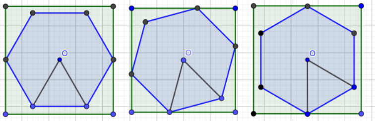

## 基础算法-三分

### [Simple Polygon Embedding](https://codeforces.com/contest/1354/problem/C2)【三分+计算几何】

对于一个边长为1的正$2n$边形，求其最小覆盖正方形的边长

### 题解

如果$n$为偶数，那么该正多边形可以旋转成如下形式


其中四条边与正方形边界平行，因此正方形的边长计算公式为
$$
ans=\frac{1}{tan\frac{\pi}{2n}}
$$
而如果$n$为奇数，不论怎么旋转最多只有两条边与正方形边界平行



因此，可以用三分的方法在旋转过程中找到一个最小覆盖正方形。根据对称性，旋转角度只需要在$0\sim \frac{\pi}{2n}$。实际上，由对称性不难猜出，应该在旋转的中间位置，即$\frac{\pi}{4n}$取到最小值，因此公式为
$$
ans=\frac{\cos(\frac{\pi}{4n})}{\sin(\frac{\pi}{2n})}
$$
这里给出$n$为奇数时用三分的方法寻找最小值的过程


用两个向量`X,Y`追踪旋转过程中最小覆盖正方形边长的变化，正方形的边长就等于$max(X向量在x轴方向投影,Y向量在y轴方向投影)*2$

### 题解

```c++
#include <bits/stdc++.h>
using namespace std;
#define mem(a,b) memset(a,b,sizeof(a))
#define endl '\n'
#define pi acos(-1)
typedef long long ll;
const int INF = 1 << 30;
const double eps = 1e-8;
struct Point {	// 点类
	double x, y;
	Point() {};
	Point(double x, double y): x(x), y(y) {}
	void operator=(const Point&a) {
		x = a.x, y = a.y;
	}
};
typedef Point Vector;
double Dot(Vector A, Vector B) {return A.x * B.x + A.y * B.y;}
double Cross(Vector A, Vector B) {return A.x * B.y - A.y * B.x;}
double Len(Vector A) {return sqrt(Dot(A, A));}	// 向量长度
Vector Rotate(Vector A, double rad)
// 向量逆时针旋转
{
	return Vector(A.x * cos(rad) - A.y * sin(rad), A.x * sin(rad) + A.y * cos(rad));
}

int n;
Vector X, Y; // 分别监测旋转过程中x,y的最小最大值

double cal(double rad)
// 计算旋转后最小正方形边长
{
	Vector tempx = Rotate(X, rad);
	Vector tempy = Rotate(Y, rad);
	return max(tempx.x, tempy.y) * 2;
}
double tsearch(double left, double right)
{
	double ans = INF;
	double mid, midmid;
	while (right - left > eps) {
		mid = (left + right) / 2;
		midmid = (mid + right) / 2;
		double ans1 = cal(mid), ans2 = cal(midmid);
		if (ans1 < ans2) {
			right = midmid;
			ans = min(ans, ans1);
		}
		else {
			left = mid;
			ans = min(ans, ans2);
		}
	}
	return ans;
}
int main()
{
	ios::sync_with_stdio(0), cin.tie(0);
	int t; cin >> t;
	while (t--) {
		cin >> n;
		X.x = 0.5 / sin(pi / (2 * n)), X.y = 0;
		Y.x = 0.5, Y.y = 0.5 / tan(pi / (2 * n));
		double sta = 0, end = pi / (2 * n);	// 旋转范围
		cout << fixed << setprecision(8) << tsearch(sta, end) << endl;
	}
	return 0;
}
```

