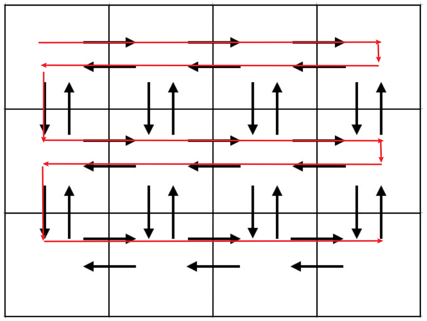
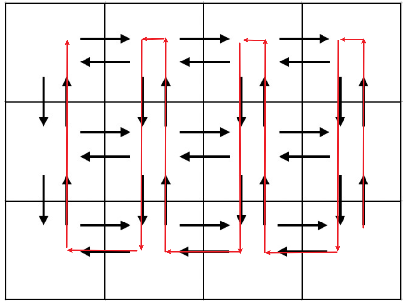

## [Time to Run](https://codeforces.com/contest/1301/problem/D)：【路径规划】

> - 题目：
>
>   在一个$n\times m$矩阵中，相邻的两个格子之间有来回两条路，可以计算得到，一共有$4nm−2n−2m$条路。
>   相邻的格子之间的距离是1，现在想要让总路程达到`k`，并且走过的路不会再走，能否构造出一种方案
>
> - 输入：
>
>   ```
>   3 3 4
>   ```
>
> - 输出：
>
>   ```
>   YES
>   2
>   2 R
>   2 L
>   ```

### 题解

可以先构造出一种极限情况，也就是把所有的路都走一遍的方法，然后根据题目要求的`k`输出走`k`距离的方案即可。

先横向来回走，直到最后一行，只向右走。然后开始纵向走，直到最后一列，只向上走。





```c++
int n, m, k;
vector<pair<int, string>> v, ans;
int main()
{
    cin >> n >> m >> k;
    for (int i = 1; i <= n - 1; i++) {
        if (m != 1) { //超过一列
            v.push_back({ m - 1, "R" });
            v.push_back({ m - 1, "L" });
        }
        v.push_back({ 1, "D" });
    }
    //最后一行，只向右走
    if (m != 1) {
        v.push_back({ m - 1, "R" });
    }
    for (int i = 1; i <= m - 1; i++) {
        if (n != 1) { //超过一行
            v.push_back({ n - 1, "U" });
            v.push_back({ n - 1, "D" });
        }
        v.push_back({ 1, "L" });
    }
    //最后一列，只向上走
    if (n != 1) {
        v.push_back({ n - 1, "U" });
    }
    for (int i = 0; i < v.size(); i++) {
        if (k >= v[i].first) {
            k -= v[i].first;
            ans.push_back(v[i]);
        } else if (k != 0 && v[i].first > k) {
            ans.push_back({ k, v[i].second });
            k = 0;
        }
    }
    if (k > 0) {
        cout << "NO" << endl;
    } else {
        cout << "YES" << endl;
        cout << ans.size() << endl;
        for (int i = 0; i < ans.size(); i++) {
            cout << ans[i].first << " " << ans[i].second << endl;
        }
    }
    return 0;
}
```


## [Shortest and Longest LIS](https://codeforces.com/contest/1304/problem/D)：【LIS】

> - 题目：
>
>   给定一个只包含`>`和`<`符号的长度为`n-1`字符串，要从`1~n`构造出一个长度为`n`的字符串，构造出来的字符串的数字大小关系要满足给定字符串的符号。求满足条件的字符串的最大、最小上升子序列的长度。
>
> - 输入：
>
>   ```
>   3
>   3 <<
>   7 >><>><
>   5 >>><
>   ```
>
> - 输出：
>
>   ```
>   1 2 3
>   1 2 3
>   5 4 3 7 2 1 6
>   4 3 1 7 5 2 6
>   4 3 2 1 5
>   5 4 2 1 3
>   ```

### 题目

首先构造长度最小的上升子序列，显然应该**把大的数字尽可能放到前面**。所以当是`>`号时，可以直接放入当前最大的数字，但如果是`<`号，则需要找出有多少个`<`号相连，并把数字从最后一个小于号一直填到第一个小于号。

对于最大的上升子序列，构造方案相似，只需要**把小的数字尽可能放到前面**。

```c++
const int maxn = 2e5 + 10;
int n, m, a[maxn], b[maxn];
string s;
void solve()
{
    cin >> n >> s;
    //构造最小上升子序列
    m = n;
    for (int i = 0; i < n; i++) {
        int len = 1;
        while (i < s.size() && s[i] == '<') { //确定连续<号的长度
            len++;
            i++;
        }
        for (int j = i; j > i - len; j--) { //按照规则依次填入当前最大的数字
            a[j] = m;
            m--;
        }
    }
    for (int i = 0; i < n; i++) {
        cout << a[i] << " ";
    }
    cout << endl;
    //构造最大上升子序列
    m = 1;
    for (int i = 0; i < n; i++) {
        int len = 1;
        while (i < s.size() && s[i] == '>') { //确定连续>号的长度
            len++;
            i++;
        }
        for (int j = i; j > i - len; j--) {
            b[j] = m;
            m++;
        }
    }
    for (int i = 0; i < n; i++) {
        cout << b[i] << " ";
    }
    cout << endl;
}
```

