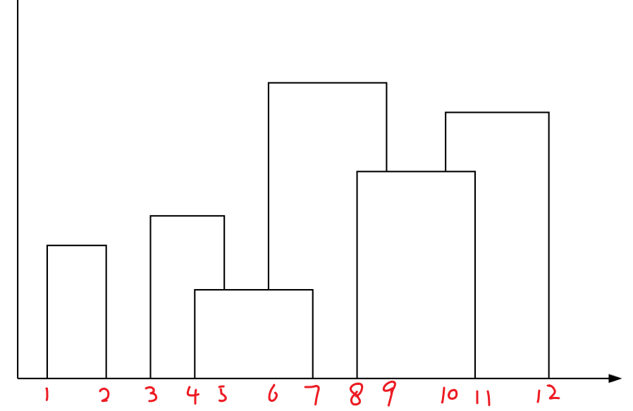

## [hdu2795](http://acm.hdu.edu.cn/showproblem.php?pid=2795)：【维护结点剩余容量】、【单点更新，单点查询】
### 题解

```c++
#define lson l, mid, rt << 1
#define rson mid + 1, r, rt << 1 | 1
const int maxn = 2e5 + 10;
struct node {
    int l, r;
    int value; //剩余容量
    int maxx; //最大剩余容量
} tree[maxn << 2];
int h, w, n;
vector<int> a;
bool flag;
int ans;
void push_up(int rt)
{
    tree[rt].maxx = max(tree[rt << 1].maxx, tree[rt << 1 | 1].maxx);
}
void build(int l, int r, int rt)
{
    tree[rt].l = l, tree[rt].r = r, tree[rt].value = w;
    if (l == r) {
        tree[rt].maxx = tree[rt].value;
        return;
    }
    int mid = (l + r) >> 1;
    build(lson);
    build(rson);
    push_up(rt);
}
void update(int a, int b, int l, int r, int rt)
{
    if (l == r && a == l) {
        tree[rt].value -= b;
        tree[rt].maxx = tree[rt].value;
        return;
    }
    int mid = (l + r) >> 1;
    if (a <= mid) {
        update(a, b, lson);
    } else {
        update(a, b, rson);
    }
    push_up(rt);
}
void find(int a, int l, int r, int rt)
{
    if (flag) {
        return;
    }
    if (l <= tree[rt].l && r >= tree[rt].r) {
        if (a > tree[rt].maxx) {
            return;
        }
    }
    if (l == r) {
        if (tree[rt].maxx >= a) {
            flag = 1;
            ans = l;
        }
        return;
    }
    int mid = (l + r) >> 1;
    find(a, lson);
    if (flag) {
        return;
    }
    find(a, rson);
    if (flag) {
        return;
    }
}
int main()
{
    while (cin >> h >> w >> n) {
        build(1, min(h, n), 1);
        for (int i = 1, temp; i <= n; i++) {
            cin >> temp;
            flag = 0;
            ans = -1;
            find(temp, 1, min(h, n), 1);
            if (ans != -1) {
                update(ans, temp, 1, min(h, n), 1);
            }
            cout << ans << endl;
        }
    }
}
```


## [hdu1394](http://acm.hdu.edu.cn/showproblem.php?pid=1394)：【逆序对】

题意：给定一个由`0-n-1`组成的序列，每次将最前面一个元素放到最后面去，形成n个序列，求n个序列中逆序数最少的序列，输出其逆序数个数

### 题解

每插入一个点之前，统计大于这个数的有多少个，直到所有的数都插入完成，就结果了逆序树的统计

如果是0到n的排列，那么如果把第一个数放到最后，对于这个序列，逆序数会减少$a[i]$，而增加$(n-1)-a[i]$

```c++
const int maxn = 5e3 + 10;
struct node {
    int l, r, num;
} tree[maxn * 2];
int n, a[maxn];
void build(int l, int r, int rt)
{
    tree[rt].l = l, tree[rt].r = r, tree[rt].num = 0;
    if (l == r)
        return;
    int mid = (l + r) >> 1;
    build(l, mid, rt << 1);
    build(mid + 1, r, rt << 1 | 1);
}
int find(int l, int r, int rt)
{
    if (l == tree[rt].l && r == tree[rt].r) {
        return tree[rt].num;
    }
    int mid = (tree[rt].l + tree[rt].r) >> 1;
    if (r <= mid) {
        return find(l, r, rt << 1);
    } else if (l > mid) {
        return find(l, r, rt << 1 | 1);
    } else {
        return find(l, mid, rt << 1) + find(mid + 1, r, rt << 1 | 1);
    }
}
void update(int x, int rt) //单点更新
{
    tree[rt].num++;
    if (tree[rt].l == tree[rt].r) {
        return;
    }
    int mid = (tree[rt].l + tree[rt].r) >> 1;
    if (x <= mid) {
        update(x, rt << 1);
    } else {
        update(x, rt << 1 | 1);
    }
}
int main()
{
    while (cin >> n) {
        build(1, n, 1);
        for (int i = 1; i <= n; i++) {
            cin >> a[i];
        }
        int sum = 0;
        for (int i = 1; i <= n; i++) {
            sum += find(a[i] + 1, n, 1); //找到已出现的，比当前数字大的数字的个数
            update(a[i], 1); //更新该数字出现次数
        }
        int ans = sum;
        for (int i = 1; i <= n; i++) {
            sum += ((n - 1) - a[i]) - a[i];
            ans = min(ans, sum);
        }
        cout << ans << endl;
    }
    return 0;
}
```


## [hdu1698](http://acm.hdu.edu.cn/showproblem.php?pid=1698)：【lazy-tag】
题意：给定$1-n$共n个数，初始每个数的权值为1，每次操作改变某一段区间中所有数的权值，求最终这n个数的权值和
### 题解
```c++
const int maxn = 1e5 + 10;
#define lson l, mid, rt << 1
#define rson mid + 1, r, rt << 1 | 1
struct node {
    int l, r;
    int sum; //区间和
} tree[maxn << 2];
int n, q;
int tag[maxn << 2];
void push_up(int rt)
{
    tree[rt].sum = tree[rt << 1].sum + tree[rt << 1 | 1].sum;
}
void push_down(int rt, int m)
{
    if (tag[rt]) { //标记下放
        tag[rt << 1] = tag[rt];
        tag[rt << 1 | 1] = tag[rt];
        tree[rt << 1].sum = (m - (m >> 1)) * tag[rt << 1];
        tree[rt << 1 | 1].sum = (m >> 1) * tag[rt << 1 | 1];
        tag[rt] = 0;
    }
}
void build(int l, int r, int rt)
{
    tree[rt].l = l, tree[rt].r = r, tree[rt].sum = 0;
    if (l == r) {
        tree[rt].sum = 1;
        return;
    }
    int mid = (l + r) >> 1;
    build(lson);
    build(rson);
    push_up(rt);
}
void update(int a, int b, int c, int l, int r, int rt)
{
    if (a <= l && b >= r) {
        tree[rt].sum = (r - l + 1) * c;
        tag[rt] = c;
        return;
    }
    push_down(rt, r - l + 1);
    int mid = (l + r) >> 1;
    if (a <= mid) {
        update(a, b, c, lson);
    }
    if (b > mid) {
        update(a, b, c, rson);
    }
    push_up(rt);
}
int query(int a, int b, int l, int r, int rt)
{
    if (a <= l && b >= r) {
        return tree[rt].sum;
    }
    push_down(rt, r - l + 1);
    int mid = (l + r) >> 1;
    int ans = 0;
    if (a <= mid) {
        ans += query(a, b, lson);
    }
    if (b > mid) {
        ans += query(a, b, rson);
    }
    return ans;
}
int main()
{
    int x, y, z;
    rush()
    {
        mem(tag, 0);
        cout << "Case " << T << ": The total value of the hook is ";
        cin >> n >> q;
        build(1, n, 1);
        for (int i = 1; i <= q; i++) {
            cin >> x >> y >> z;
            update(x, y, z, 1, n, 1);
        }
        cout << tree[1].sum << "." << endl;
    }
}
```


## [Finally, christmas! ]((https://codeforces.com/gym/102448/problem/F))

### :question:【离散化】

> - 题目
>
>   在`x`轴正向上，给出`n`个可以重叠的矩形，问所有矩形的面积
>
> - 输入
>
>   `N`个矩形，$1\le N\le 10^5$。
>   每个矩形给定左边界、右边界以及高度，$0\le L_i<R_i\le10^9$，$1\le H_i\le10^6$
>
>   ```
>   6
>   2 6 9
>   9 14 11
>   12 20 6
>   17 25 20
>   23 31 14
>   29 36 18
>   ```
>
> - 输出
>
>   ```
>   451
>   ```

### 题解

考虑到实际上一共只有$10^5$个矩形，可以将坐标进行离散化，用线段树维护坐标对应的最大值即可。
原先离散的坐标排好序后当作一个新的`x`轴，只需要考虑记录每个区间的最高高度。



```c++
const int maxn = 2e5 + 10;
int n;
struct node_in {
	int l, r, h;
} a[maxn];
struct node {
	int l, r;
	int value;
} tree[maxn << 2];
int tag[maxn << 2];
int temp[maxn << 2]; //离散化
inline void push_up(int rt)
{
	tree[rt].value = max(tree[rt << 1].value, tree[rt << 1 | 1].value);
}
void push_down(int rt, int m)
{
	if (tag[rt]) { //标记下放
		tag[rt << 1] = max(tag[rt << 1], tag[rt]);
		tag[rt << 1 | 1] = max(tag[rt << 1 | 1], tag[rt]);
		tree[rt << 1].value = max(tag[rt], tree[rt << 1].value);
		tree[rt << 1 | 1].value = max(tag[rt], tree[rt << 1 | 1].value);
		tag[rt] = 0;
	}
}
void build(int l, int r, int rt)
{
	tree[rt].l = l, tree[rt].r = r;
	if (l == r) {
		tree[rt].value = 0;
		return;
	}
	int mid = (l + r) >> 1;
	build(lson);
	build(rson);
}
void update(int a, int b, int c, int l, int r, int rt)
{
	if (a <= l && b >= r) {
		tree[rt].value = max(tree[rt].value, c);
		tag[rt] = max(tag[rt], c);
		return;
	}
	push_down(rt, r - l + 1);
	int mid = (l + r) >> 1;
	if (a <= mid) {
		update(a, b, c, lson);
	}
	if (b > mid) {
		update(a, b, c, rson);
	}
	push_up(rt);
}
int query(int a, int b, int l, int r, int rt)
{
	if (a <= l && b >= r) {
		return tree[rt].value;
	}
	push_down(rt, r - l + 1);
	int mid = (l + r) >> 1;
	int ans = 0;
	if (a <= mid) {
		ans = max(ans, query(a, b, lson));
	}
	if (b > mid) {
		ans = max(ans, query(a, b, rson));
	}
	return ans;
}
int main()
{
	cin >> n;
	int cnt = 0;
	for (int i = 1; i <= n; i++) {
		cin >> a[i].l >> a[i].r >> a[i].h;
		temp[cnt++] = a[i].l;
		temp[cnt++] = a[i].r;
	}
	sort(temp, temp + cnt);
	cnt = unique(temp, temp + cnt) - temp;
	for (int i = 1; i <= n; i++) {
		int l = lower_bound(temp, temp + cnt, a[i].l) - temp + 1;
		int r = lower_bound(temp, temp + cnt, a[i].r) - temp + 1;
		update(l, r - 1, a[i].h, 1, cnt - 1, 1);
	}
	int sum = 0;
	for (int i = 0; i < cnt - 1; i++) {
		sum += query(i + 1, i + 1, 1, cnt - 1, 1) * (temp[i + 1] - temp[i]);
	}
	cout << sum << endl;
	return 0;
}
```

