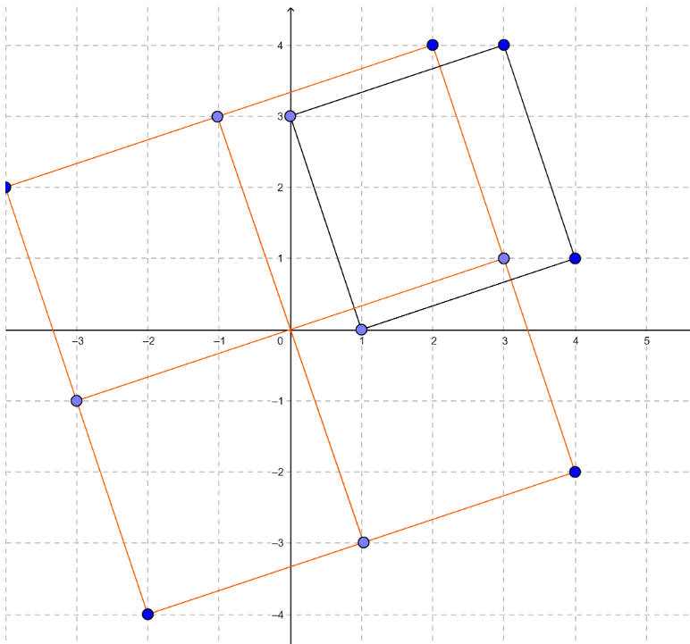

## [Aerodynamic](https://codeforces.com/contest/1300/problem/D)：多边形中心对称

> - 题目：
>
>   给定一个凸多边形，在保证原点在多边形内部的情况下，可以任意移动该多边形，形成一个尽可能大的多边形，判断新形成的多边形是否与原多边形相似
>
> - Input:
>
>   ```
>   4
>   1 0
>   4 1
>   3 4
>   0 3
>   ```
>
> - Output:
>
>   ```
>   YES
>   ```
>
> 

### 题解

考虑把原多边形的每一个顶点放到原点上，那么新形成的多边形一定会是一个中心对称图形，因为每一条过原点的连线都是由原多边形的同一条边构成的，所以只需要判断原多边形是否为中心对称图形

- **注意**：多边形的中心就是坐标之和除以点数，为了防止除法出现小数，所以先对每个点进行放大。

```c++
const int maxn = 1e5 + 10;
map<pair<int, int>, int> m;
int n;
ll x[maxn], y[maxn];
int main()
{
    ll n;
    cin >> n;
    ll midx = 0, midy = 0;
    for (int i = 1; i <= n; i++) {
        cin >> x[i] >> y[i];
        x[i] *= n, y[i] *= n;	//因为之后要除以n，所以先对每个点放大n倍
        midx += x[i], midy += y[i];
        m[make_pair(x[i], y[i])] = 1;	//记录坐标
    }
    midx /= n, midy /= n;
    for (int i = 1; i <= n; i++) {
        //判断与这个点呈中心对称的点是否存在
        if (m[make_pair(2 * midx - x[i], 2 * midy - y[i])] == 0) {	
            cout << "NO" << endl;
            return 0;
        }
    }
    cout << "YES" << endl;
    return 0;
}
```

