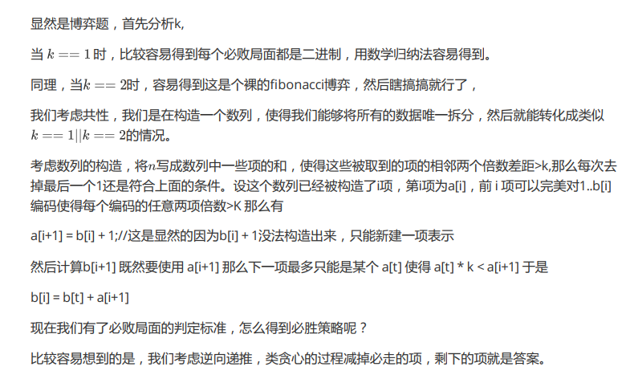

## 数学-博弈论

### :question:qiqi and sciorz[^1]（k倍博弈）

> - 题目
>
>   一堆石子，qiqi先取，每次最少取一个，第一次取最多取n-1个，之后每次取的个数不能超过上一次的k倍，取走最后一个石子获胜
>
> - 输入：
>
>   ```
>   2
>   2 1000 //n,k
>   3 1
>   ```
>
> - 输出：
>
>   ```
>   qiqi lose
>   1 //qiqi获胜时，输出第一次应该取走多少个
>   ```



```c++
#include <bits/stdc++.h>
using namespace std;
const int maxn = 1e5+10;
int a[maxn],b[maxn];
int main()
{
    int T;
    scanf("%d", &T);
    while(T--)
    {
        int n, k;
        scanf("%d %d", &n, &k);
        int i = 0, j = 0;
        a[i] = b[j] = 1;
        while(a[i] < n)
        {
            ++i;
            a[i] = b[i - 1] + 1;
            while(k * a[j + 1] < a[i])  ++j;
            if(k * a[j] < a[i]) b[i] = a[i] + b[j];
            else                b[i] = a[i];
        }
        if(a[i] == n)
        {
            printf("qiqi lose\n");
            continue;
        }
        int ans;
        while(n)
        {
            if(n >= a[i])
            {
                n -= a[i];
                ans = a[i];
            }
            --i;
        }
        printf("%d\n", ans);
    }
    return 0;
}
```

[^1]:[中国石油大学ACM开放训练赛](https://www.cnblogs.com/QingyuYYYYY/p/12446909.html)

