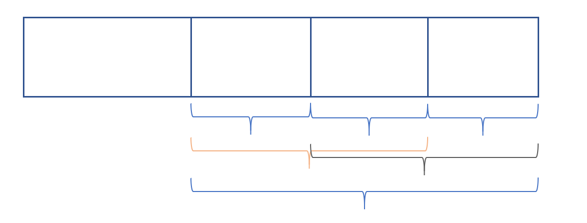

## [Anu Has a Function](https://codeforces.com/contest/1300/problem/C)：【运算符性质（或、与）】
> - 题意：给定一种运算方式，$f(x,y)=(x|y)-y$（`|`表示按位或）。对于一个数组$[a_1,a_2,\dots a_n]$，其结果是$f(f(\dots f(f(a_1,a_2),a_3),\dots a_{n-1}),a_n)$。可以任意排列这个数组，要求让结果最大。
> - Input
>   4
>   4 0 11 6
> - Output
>   11 6 4 0

### 题解
$f(x,y)=(x|y)-y$等价于$x\&(\sim y)$（`~`表示按位取反）
$x|y-y$所影响的是二进制中$x$和$y$都为1的位，如果将$y$取反，然后再与$x$取与操作，那么原来都为1的位就会变成0，其他情况则不影响。

所以最终结果为$a_1\&(\sim a_2)\&\dots (\sim a_n)$，这个结果只由第一个元素影响，剩下的元素可以随意交换顺序
对于数组中每一个数，记录除了它本身外其他元素取反后再取与的结果，实际上可以维护前缀与后缀，找到结果最大的并将这个数放在第一位就可以
```c++
#include <bits/stdc++.h>
using namespace std;
int main()
{
    int n;
    cin >> n;
    vector<int> a(n + 1), pre(n + 1), suf(n + 1), ans(n + 1);
    for (int i = 1; i <= n; i++) {
        cin >> a[i];
        //维护前缀
        if (i == 2) { 
            pre[i] = ~a[i - 1];
        } else if (i > 2) {
            pre[i] = (~a[i - 1]) & pre[i - 1];
        }
    }
    //维护后缀
    for (int i = n - 1; i >= 1; i--) {
        if (i == n - 1) {
            suf[i] = ~a[i + 1];
        } else {
            suf[i] = (~a[i + 1]) & suf[i + 1];
        }
    }
    //计算数组中每个元素的结果
    for (int i = 1; i <= n; i++) {
        if (i == 1) {
            ans[1] = a[1] & suf[1];
        } else if (i == n) {
            ans[n] = a[n] & pre[n];
        } else {
            ans[i] = a[i] & pre[i] & suf[i];
        }
    }
    int mx = -1, pos = 0;
    //找到结果最大的那个元素
    for (int i = 1; i <= n; i++) {
        if (ans[i] > mx) {
            mx = ans[i];
            pos = i;
        }
    }
    swap(a[1], a[pos]);
    for (int i = 1; i <= n; i++) {
        cout << a[i] << " ";
    }
}
```


## [子段异或](https://ac.nowcoder.com/acm/contest/3005/D)：【前缀异或和】

> - 题目：
>
>   给定一个数列a，输出其中异或值为0的不同子段的数量
>
> - Input：
>
>   ```
>   5
>   1 2 3 2 1
>   ```
>
> - Output：
>
>   ```
>   2
>   ```

### 题解

考虑样例，$1\oplus 2=3$，$1\oplus 2\oplus3\oplus2\oplus1=3$，那么可以得出$3\oplus 2\oplus 1=0$。从$1\oplus 2\oplus3\oplus2\oplus1$变成$3\oplus 2\oplus 1$可以看作是再异或了一个$1\oplus 2$，因为两部分异或结果相等，所以异或后就成为了0。

所以可以用`map`记录异或前缀和，统计每一个数字有多少个前缀异或和等于那个数字即可。

设有n个前缀和等于该数字，那么结果就是$n*(n-1)$。



- **注意：**异或和为0的需要特殊处理，因为异或和为0的部分不需要再去异或前面的一段来让结果变成0

```
const int maxn = 200000 + 10;
int n, a[maxn];
map<int, int> mp;
map<int, int>::iterator it;
int main()
{
    cin >> n;
    vector<int> a(n);
    int temp = 0;
    for (int i = 0; i < n; i++) {
        cin >> a[i];
        temp ^= a[i];
        mp[temp]++;
    }
    ll ans = 0;
    mp[0]++;
    for (it = mp.begin(); it != mp.end(); it++) {
        int temp = it->second;
        ans += 1ll * temp * (temp - 1) / 2;
    }
    cout << ans << endl;
    return 0;
}
```

